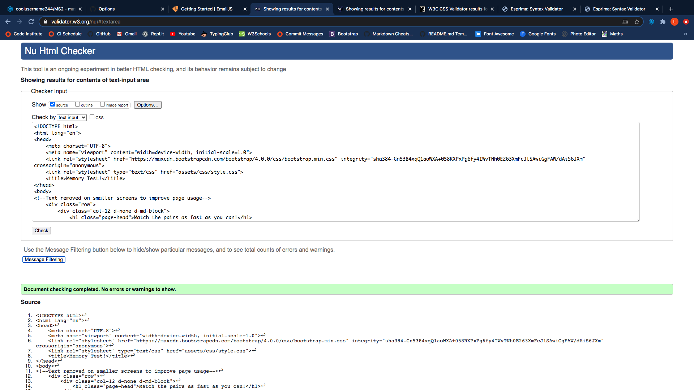
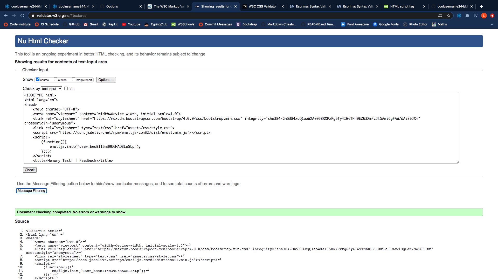
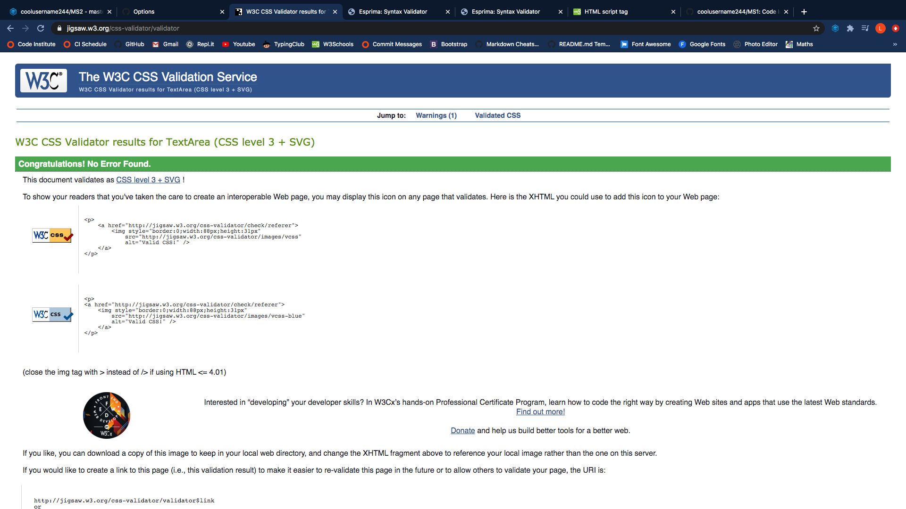
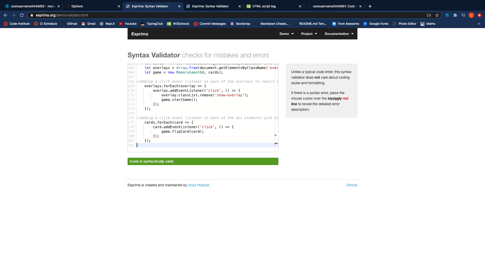
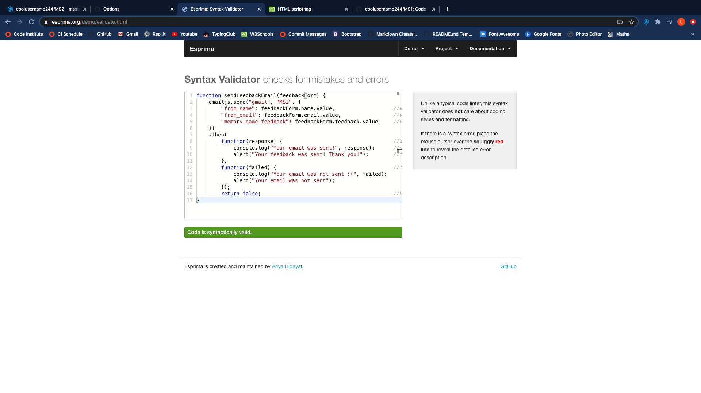
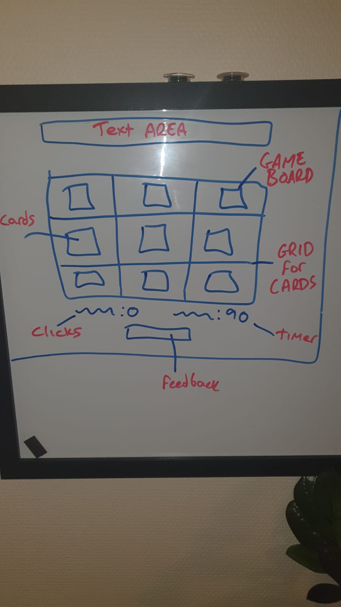

# Memory Game! - Milestone 2 Project
A simple card mathing game where the objective is to match all of the pairs before the time runs out, with the lowest amount of clicks!

To view the live version of the site, please click [here](https://coolusername244.github.io/MS2/)!

---
## UX Design

- As a user, I would like to have a simple theme for such a game to reduce any unwanted distractions and 
be allowed to focus on the game at hand. 

This has been achieved by using a minimal design and light colors as to not be too 
distracting or invasive. 

- As a user of this game, i would like there to be a contrast between the cards and the background.

To enable a more enjoyable experience, i have added a gradual graient inside of the game board horizontally,
going from light blue to white.

- As a user, I would like there to be some kind of seperate system for before the game begins and after
 it has ended.

When the site is initially loaded, the user will be greeted with the start screen which is a a lot darker than
the rest of the page, this is to now draw the users attention away from the game and now towards the rules of the 
start screen.

- As a user, if I have won or lost the game, I would like there to be some kind of change which notifies me of
 what is happening.

 If the 'Time Remaining' reaches 0, the user will no longer be able to continue as there will be another 
 dark overlay which covers the screen explaining that they have lost the game, a game-over sound will be played
 users are welcome to try again by simply clicking on the screen and the whole page will be refreshed, good as new.
 
 Similarly, if the user wins the game, a victory sound will be played as well as the dark overlay appearing, congratulating
 the user on winning the game, as well as inviting them to play again simply by clicking on the screen.

- As a user, I would like there to be sounds which keep me engaged and that celebrate my victory
   of matching two cards.

When a user clicks on any card, there will be a litle flip sound played. If the user then proceeds to flip another
card and is lucky enough to make a match, there will be a little chime played to let the user know that they have
been successful in making a match. 
 
- As a user, I would like to be able to report any problems which I may find during my experience while playing the 
game.

To enable users to do this, I have added in a feedback form which is locted on a different page. Users can easily gain 
access to this by clicking on the link at the bottom of the page which is clearly directing them to an area to leave feedback.

All sections of the feedback form will have to be filled out in order for the user to send the feedback to me, this prevents
any missing infomation being sent. 

Once the submit button has been clicked and the sending of the email is successful, the user will be notified of this in the form 
of a JavaScript alert box which will pop up and show them the success message, similarly, if there is an error in sending the email,
they will be notified of this in the same way. 

---

## Features

Feature 1 - Cards 

- You cannot play a card matching game without the cards themselves!
These cards have been constructed using html and CSS. Each card contains 3 divs in order to work correctly,
the card container, the front face and the back face. There are 12 cards which are divided into pairs and each 
pair contain a unique value. In this case, the values are types of fruit. 

Feature 2 - Game Board 

- To give users a better experience, all of the cards are located within a container which seperates it visually 
from the rest of the page, drawing the focus to the game.

Feature 3 - Overlays

- The purpose of the 3 overlays is to increase the flow of the game. If the game is over, the user is made aware 
and the game will stop, same for if the user wins. Each of the overlays has an event listener enabling the user to simply
click to start or restart the game. 

Feature 4 - Time Remaining

- When the user starts a game, the timer will begin to count down from 60, this gives the user a sense of urgency
and shows that they have x seconds remaining to complete the game. If the game is completed before the timer runs out 
then the clock will stop ticking. 

Feature 5 - Click Counter

- When playing the game, the main purpose is to complete the game in as few moves as possible, enabling users to compete with 
friends and see who has the lowest count upon game completion.

Feature 6 - Feedback Form 

- Users are able to report any issues that they encounter by simply clicking on the 'click here' at the bottom
of the page. This action will redirect the user to the feedback form which they will be promted to fill each box
and when they are ready to submit, click the submit button. If the email is sent successfuly then they will see an 
alert box pop up confirming that the email has been sent, likewise, if the email is not sent for whatever reason, they will 
also be notified.

### Features Left to Impliment

- Difficulty: 

    - I would like to add a difficulty feaature which enables users to choose from easy, medium and hard.
    The differences would include an increasing amount of cards.

- Feedback Modal:

    - To ensure a smoother user experience, another future implimentation would include a feedback modal
    so that users would not have to leave the game page.

- Theme Selector:
    
    - Instead of having just one theme, which is blue with fruit values, I think it would be good to have a theme
    selector where people are able to change the color of the backround and instead of fruit, have landmarks/flags etc.

---

## Technology Used 

For my milestone 2 project, the technologies I have used include:

- HTML5 

    - To give the page its content - index.html & feedback.html

- CSS

    - All styling has been done through CSS - located in 'assets/css/style.css'

- CSS Grid

    - I have used CSS Grid to help layout the cards in a 4 column grid on devices larger than 600px wide, 
    and a 3 column grid on devices smaller than 600px.

- JavaScript

    - To give the game the logic that is required, i have used JavaScript - located in 'assets/scripts/...'

- Bootstrap

    - Bootstrap has been used to make some elements responsive to different screen sizes such as the time remaining 
    and click counter elements - when on a smaller device, the elements will move on top of each other as apposed to being 
    side-by-side.

- Google Fonts

    - The font that I have used is called Merriweather and can be found [here](https://fonts.google.com/specimen/Merriweather?query=Merriweather)

- EmailJS

    - I have also used emailJS (visit their website [here](https://www.emailjs.com/docs/)). This has allowed me to have users
    send me feedback via email from the feedback form located in feedback.html.

---

## Testing

[HTML Validator](https://validator.w3.org/#validate_by_input) has been used to test the HTML pages in this repository.
    
Below you will find screenshots from the HTML Validator:
 
- index.html

- feedback.html

[CSS Validator](https://jigsaw.w3.org/css-validator/) has been used to check the CSS as shown below:

- style.css

To test JavaScript validity, i have used [Esprima](https://esprima.org/demo/validate.html). See below for successful tests:

- script.js 

- feedback.js

- Google Chrome Developer Tools

    - Google Chrome Developer Tools were used throughout the process as an aid to make sure that all changes that were being implimented, 
    worked properly. Also to test responsiveness on other device sizes.

- Samsung Galaxy S10

    - Once i had finished the JavaScript for the game, I tested it out with my personal phone as well, I pushed the repo and used this [link](https://coolusername244.github.io/MS2/) to 
    access. It was only when I used my personal phone that I understood that a 3 column game board was more suitable to mobile devices.

    

---

## Wireframes 

Please see below the wireframes that I based the design from 

- Desktop Full Screen 

- Mobile Full Screen

- Feedback page

---
